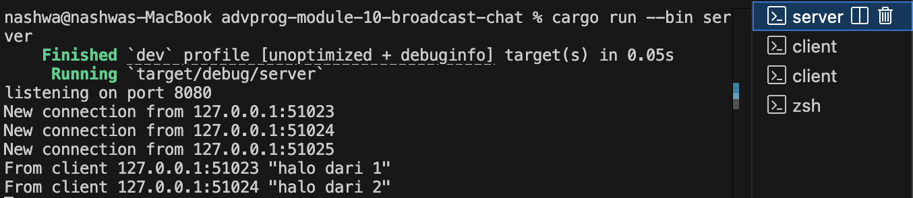
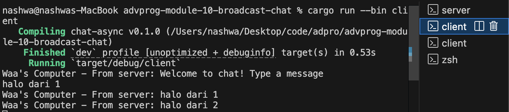
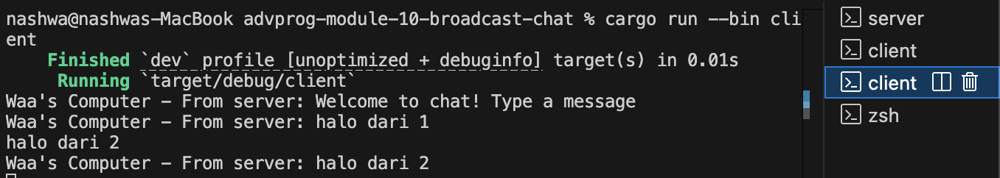

Pemrograman Lanjut (Advanced Programming) 2024/2025 Genap

- Nama : Nashwa Ghania
- NPM : 2306241770
- Kelas : Pemrograman Lanjut - A

### Reflection:
#### 2.1. Original code of broadcast chat.

Server dijalankan pada alamat 127.0.0.1:2000, menerima koneksi WebSocket dari klien, lalu mem-broadcast pesan yang diterima ke semua klien yang terhubung. Klien dapat mengirim pesan lewat terminal, dan pesan tersebut akan dikirim ke server lalu diteruskan ke semua klien lain, termasuk dirinya sendiri. Untuk menjalankan, cukup kompilasi dan jalankan kode server di satu terminal, lalu jalankan kode client di terminal lain. Saat mengetik teks di client, pesan tersebut dikirim ke server dan langsung muncul di semua client yang terhubung sebagai pesan dari server.

#### 2.2. Modifying the websocket port

Agar program berjalan dengan baik, perlu dipastikan bahwa port yang digunakan di client.rs dan server.rs sama. Jika port pada salah satu file berbeda dengan yang lain, maka client tidak akan bisa terhubung ke server. Dengan kata lain, port harus disesuaikan supaya koneksi antara client dan server bisa berjalan lancar.

#### 2.3. Small changes. Add some information to client

Perubahan pada bagian Some(Ok(msg)) di client yaitu menambahkan teks "Waa's Computer - From server: {}", bertujuan untuk membuat pesan yang diterima dari server menjadi lebih jelas dan personal. Dengan menambahkan label seperti "Waa's Computer", kita bisa langsung tahu pesan tersebut datang ke client yang mana, terutama saat ada banyak client yang terhubung dan saling bertukar pesan. Jadi, perubahan ini membantu memudahkan identifikasi sumber pesan di sisi client tanpa harus bingung, sekaligus memberi sentuhan yang lebih ramah dan informatif pada tampilan outputnya. 